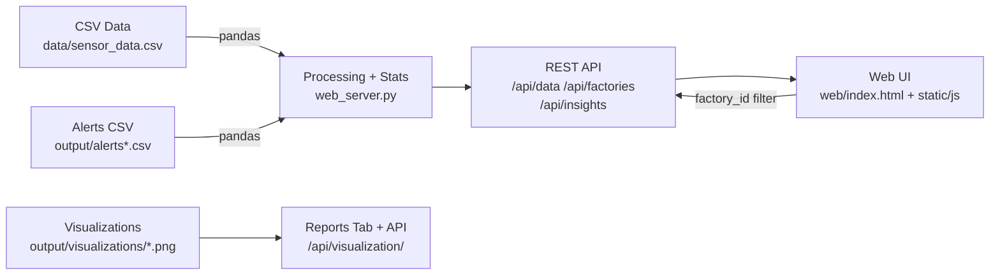

# Predictive Maintenance System

Real-time machine health monitoring with anomaly detection, factory filtering, and an interactive dashboard.

This project ingests machine sensor readings (temperature/vibration), generates alerts + visualizations, and serves a Flask-powered web UI for monitoring, analytics, and reports.

## Features

- **Real-time Monitoring** - Live KPIs, charts, alerts, and activity feed
- **Factory Filter** - View "All Factories" or a specific factory across the UI
- **Anomaly Detection** - Temperature/vibration thresholds + spike detection
- **Interactive Dashboard** - Modern single-page UI (Overview / Machines / Alerts / Analytics / Reports / Settings)
- **Reports & Visualizations** - Image-based analysis sections and downloadable report HTML

## Tech Stack

- **Backend:** Python, Flask, Pandas, NumPy
- **Frontend:** HTML, CSS, JavaScript
- **Charts:** Chart.js (and ApexCharts where used)
- **Visualizations/Reports:** Matplotlib/Seaborn -> PNGs + HTML report
- **Data:** CSV files in `data/` (optionally AI4I 2020 dataset)

## Architecture Overview

High-level flow:



Runtime components:
- **Flask server** serves the UI and REST endpoints.
- **Front-end SPA** loads data from REST endpoints and re-renders pages on navigation and factory changes.
- **CSV-backed storage** keeps this project simple and portable (no DB required).

## Quick Start

### 1. Install Dependencies
```bash
pip install -r requirements.txt
```

### 2. Run Everything (One Command)
```bash
python run.py
```

This will typically:
- Check/prepare data
- Generate visualizations
- Create reports
- Start the web server
- Open the dashboard at `http://localhost:5000`

## Dashboard Features

### Navigation Tabs
- **Overview** - Real-time KPIs, charts, and activity feed
- **Machines** - Machine fleet cards built from the latest loaded dataset
- **Alerts** - Alert management view
- **Analytics** - Advanced charts and insights
- **Reports** - Visualizations + warning alert section
- **Settings** - System configuration

### Key Metrics
- Total Machines
- Total Readings
- Critical / Warning counts
- System Health score

## Visualizations

Located in `output/visualizations/` (generated by the Python pipeline):
- Temperature Distribution
- Vibration Analysis
- Alert Timeline
- Anomaly Heatmap

Note: some visualizations may be generated even if not displayed in the current Reports tab UI.

## Manual Usage

### Run Analysis
```bash
python main_windows.py
```

### Generate Visualizations
```bash
python visualizations.py
```

### Start Web Server
```bash
python web_server.py
```
Open `http://localhost:5000`

## Dataset

**AI4I 2020 Predictive Maintenance Dataset**
- 10,000 sensor readings
- Temperature and vibration data
- Machine IDs with timestamps

## Detection Criteria

- **Critical:** Temperature > 320K or temperature spike > 15K
- **Warning:** Vibration > 2000 RPM or vibration spike > 500 RPM
- **Normal:** Within safe operating parameters

## Results

Results depend on the CSV data in `data/` and `output/`. The dashboard updates on a periodic refresh interval (configurable in Settings).

## For Development

### Interactive Demo Menu
```bash
python demo_all.py
```

Choose from:
1. Start Web Dashboard
2. Open HTML Report
3. Open Visualizations
4. Launch Everything
5. Exit

## API Endpoints

- `GET /` - Main dashboard
- `GET /api/factories` - List of available factory IDs
- `GET /api/data?file=sensor_data[&factory_id=...]` - Sensor readings
- `GET /api/data?file=alerts[&factory_id=...]` - Alerts
- `GET /api/insights[?factory_id=...]` - Aggregated health/risk insights
- `GET /api/statistics[?factory_id=...]` - System statistics
- `GET /api/machine/<id>` - Machine details
- `GET /api/visualization/<file>` - Visualization images

## License

This project is built for educational and hackathon purposes.

---

**Ready to demo?** Run `python run.py` and open `http://localhost:5000`
